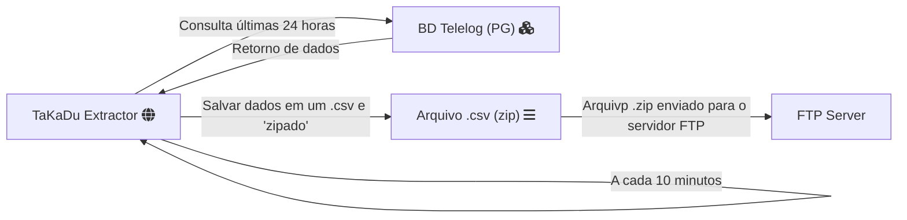

<div class="markdown prose w-full break-words dark:prose-invert dark">
<h1>Projeto TaKadu</h1>
<p>Exemplo de como configurar o script.</p>

<h2>Pré-requisitos</h2>
<ul><li>Python 3.10</li>
<li>Módulo <code>psycopg2</code> para conexão com o banco de dados PostgreSQL</li>
<li>Módulo <code>pandas</code> para manipulação de dados</li>
<li>Módulo <code>rocketry</code></li>
<li>Módulo <code>redmail</code></li>
<li>Arquivo de configuração <code>database.ini</code> contendo as informações de conexão</li></ul>

<h2>Configuração do Arquivo config.ini</h2>
<p>Crie um arquivo <code>config.ini</code> na raiz do seu projeto com as seguintes informações de conexão:</p>

```text
[postgresql]
database = infralogajoinvillemessage
host = 192.168.5.11
port = 5432

[default]
PATH_FILE_ID_SENSORS = ./data/sensors.csv
PATH_FOLDER_OUT = ./out

[notify_outlook]
receivers = jeferson.machado@aguasdejoinville.com.br

[ftp]
agua_dir = ./upload/
esgoto_dir = ./upload/esgoto/
host = 6ksw2yv67az4o.eastus.azurecontainer.io
```

<h3>Configurações via variáveis de ambiente (DB)</h3>

Abra o Prompt de Comando e execute o seguinte comando:
Windows cmd:
```shell
setx PG_USER "your_user_db"
setx PG_PASSWORD "your_password_db"
```
Windows powershell
```shell
$env:PG_USER="your_user_db"
$env:PG_PASSWORD="your_password_db"
```
Linux e MacOS:
```shell
export PG_USER="your_user_db"
export PG_PASSWORD="your_password_db"
```

<h3>Configurações via variáveis de ambiente (FTP)</h3>

Abra o Prompt de Comando e execute o seguinte comando:
Windows cmd:
```shell
setx FTP_USER "your_user_ftp"
setx FTP_PASSWORD "your_password_ftp"
```
Windows powershell
```shell
$env:FTP_USER="your_user_ftp"
$env:FTP_PASSWORD="your_password_ftp"
```
Linux e MacOS:
```shell
export FTP_USER="your_user_ftp"
export FTP_PASSWORD="your_password_ftp"
```

<p> Para as notificações de erro funcionarem será necessário definir variáveis de ambiente.</p>

Abra o Prompt de Comando e execute o seguinte comando:
Windows cmd:
```shell
setx EMAIL_USERNAME "your_email_username"
setx EMAIL_PASSWORD "your_email_password"
```
Windows powershell
```shell
$env:EMAIL_USERNAME "your_email_username"
$env:EMAIL_PASSWORD "your_email_password"
```
Linux e MacOS:
```shell
export EMAIL_USERNAME="your_email_username"
export EMAIL_PASSWORD="your_email_password"
```

Observe que essas variáveis de ambiente só estarão disponíveis no terminal atual. Se você abrir um novo terminal, precisará definir as variáveis de ambiente novamente.


## Argumentos

O programa aceita os seguintes argumentos de linha de comando:

- `-t, --tempo <valor>`: Define o tempo em minutos para executar o método. O valor padrão é 10 (minutos).

- `-dr, --tempo <valor>`: Define o tempo em minutos para executar o método. O valor padrão é 10 (minutos).

- `-f, --list_sensors <caminho>`: Define o caminho do arquivo de lista de sensores. O valor padrão é "data/sensors.csv".

## Exemplos de Uso

### Exemplo 1: Executar o programa com valores padrão

```bash
python main.py -t 30 -dr 2 -f data/meusensores.csv
```

### Exemplo 2: Executar no Linux usando crontab

Abra o arquivo crontab para edição:
```bash
crontab -e
```

adicone uma linha para definir as variáveis de ambiente ante de chamar o script
```bash
@reboot PG_USER=seu_usuario PG_PASSWORD=sua_senha /caminho/para/seu/script.py -t 30 -dr 2
```

## Configurar GSUTIL (Google)

Necessário instalar o gsutil para executar comandos no prompt. Com a conta do Gmail autorizada para enviar os arquivos.


### Fluxo

