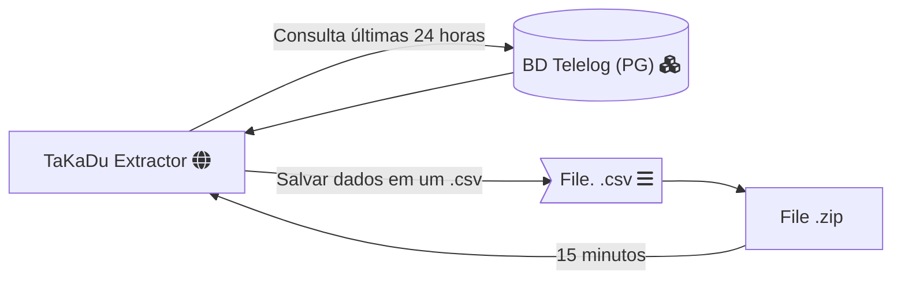

<div class="markdown prose w-full break-words dark:prose-invert dark">
<h1>Configuração do Banco de Dados PostgreSQL</h1>
<p>Este repositório fornece um exemplo de como configurar e se conectar a um banco de dados PostgreSQL.</p>

<h2>Pré-requisitos</h2>
<ul><li>Python 3.x</li>
<li>Módulo <code>psycopg2</code> para conexão com o banco de dados PostgreSQL</li>
<li>Módulo <code>pandas</code> para manipulação de dados</li>
<li>Módulo <code>rocketry</code></li>
<li>Módulo <code>redmail</code></li>
<li>Arquivo de configuração <code>database.ini</code> contendo as informações de conexão</li></ul>

<h2>Configuração do Arquivo config.ini</h2>
<p>Crie um arquivo <code>config.ini</code> na raiz do seu projeto com as seguintes informações de conexão:</p>

```text
[postgresql]
database = your_database_name
user = your_user
password = your_password
host = your_host
port = your_port

[default]
PATH_FILE_ID_SENSORS = ./data/sensors.csv
PATH_FOLDER_OUT = ./out
```

<h3>Configurações via variáveis de ambiente (DB)</h3>

Abra o Prompt de Comando e execute o seguinte comando:
Windows cmd:
```shell
setx PG_DATABASE "database_name"
setx PG_HOST "hostname"
setx PG_PORT "port"
setx PG_USER "your_user_db"
setx PG_PASSWORD "your_password_db"
```
Windows powershell
```shell
$env:PG_DATABASE="database_name"
$env:PG_HOST="hostname"
$env:PG_PORT="port"
$env:PG_USER="your_user_db"
$env:PG_PASSWORD="your_password_db"
```
Linux e MacOS:
```shell
export PG_DATABASE="database_name"
export PG_HOST="hostname"
export PG_PORT="port"
export PG_USER="your_user_db"
export PG_PASSWORD="your_password_db"
```

<p> Para as notificações de erro funcionarem será necessário definir variáveis de ambiente.</p>

Abra o Prompt de Comando e execute o seguinte comando:
Windows cmd:
```shell
setx EMAIL_USERNAME "your_email_username"
setx EMAIL_PASSWORD "your_email_password"
```
Windows powershell
```shell
$env:EMAIL_USERNAME "your_email_username"
$env:EMAIL_PASSWORD "your_email_password"
```
Linux e MacOS:
```shell
export EMAIL_USERNAME="your_email_username"
export EMAIL_PASSWORD="your_email_password"
```

Observe que essas variáveis de ambiente só estarão disponíveis no terminal atual. Se você abrir um novo terminal, precisará definir as variáveis de ambiente novamente.


### Teste 1
- 1 Serviço de API
- 1 Serviço de Banco de dados

