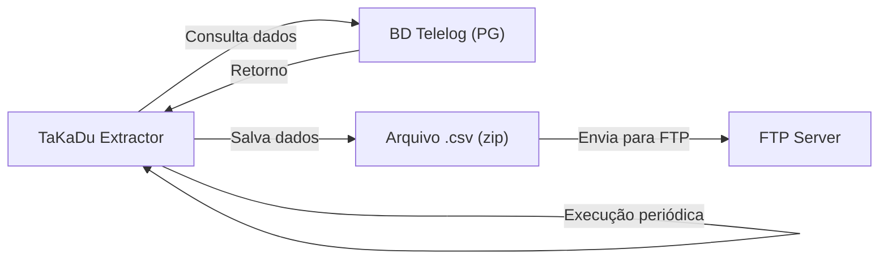

# Projeto TaKadu

Sistema de coleta e envio de dados de telemetria para análise no ambiente TaKadu.

## Índice
1. [Pré-requisitos](#pré-requisitos)
2. [Instalação](#instalação)
3. [Configuração](#configuração)
4. [Execução](#execução)
5. [Documentação Técnica](#documentação-técnica)

## Pré-requisitos

- Python 3.10 ou superior
- Módulos Python:
  - psycopg2 (conexão PostgreSQL)
  - pandas (manipulação de dados)
  - rocketry (agendamento)
  - redmail (notificações)
- Conta Google Cloud com acesso ao Storage
- Acesso ao banco de dados Telelog

## Instalação

1. Clone o repositório:
```bash
git clone [URL_DO_REPOSITÓRIO]
cd TaKadu
```

2. Instale as dependências:
```bash
pip install -r requirements.txt
```

3. Crie as pastas necessárias:
```bash
mkdir -p data out/uploaded
```

## Configuração

### 1. Arquivo config.ini

Crie um arquivo `config.ini` na raiz do projeto:

```ini
[postgresql]
database = infralogajoinvillemessage
host = 192.168.5.11
port = 5432

[default]
PATH_FILE_ID_SENSORS = ./data/sensors.csv
PATH_FOLDER_OUT = ./out

[notify_outlook]
receivers = seu.email@exemplo.com

[google_cloud]
agua_dir = ./upload/
esgoto_dir = ./upload/esgoto/
```

### 2. Variáveis de Ambiente

Configure as variáveis de ambiente necessárias:

#### Windows (CMD)
```cmd
setx PG_USER "seu_usuario_db"
setx PG_PASSWORD "sua_senha_db"
setx EMAIL_USERNAME "seu_email"
setx EMAIL_PASSWORD "sua_senha_email"
```

#### Windows (PowerShell)
```powershell
$env:PG_USER="seu_usuario_db"
$env:PG_PASSWORD="sua_senha_db"
$env:EMAIL_USERNAME="seu_email"
$env:EMAIL_PASSWORD="sua_senha_email"
```

#### Linux/Mac
```bash
export PG_USER="seu_usuario_db"
export PG_PASSWORD="sua_senha_db"
export EMAIL_USERNAME="seu_email"
export EMAIL_PASSWORD="sua_senha_email"
```

### 3. Lista de Sensores

Crie ou atualize o arquivo `data/sensors.csv` com a lista de sensores:

```csv
type;Subnet;Sensor
AGUA;SUB_333;SEN_12345
ESGOTO;SUB_433;SEN_67890
```

## Execução

### 1. Execução Automática

```bash
python main.py -t 30 -dr 2 -ls data/sensors.csv
```

Parâmetros:
- `-t, --tempo`: Intervalo de execução em minutos (padrão: 30)
- `-dr, --date_range`: Intervalo de tempo em horas para coleta (padrão: 2)
- `-ls, --list_sensors`: Caminho do arquivo de sensores (padrão: data/sensors.csv)

### 2. Execução Manual
Para executar o script manualmente e processar dados de um período específico, você precisa modificar diretamente as datas no método run_app.

Localize estas linhas no código:
```
_start_date = datetime.datetime.strptime('25/10/24 00:00:00', '%d/%m/%y %H:%M:%S')
_end_date = datetime.datetime.strptime('9/11/24 00:00:00', '%d/%m/%y %H:%M:%S')
```

Modifique as datas conforme necessário e execute o script diretamente:
```bash
python main.py
```

## Documentação Técnica

Para detalhes técnicos sobre:
- Adição de novos sensores
- Configuração do GSUTIL
- Funcionamento do script de envio
- Fluxo de dados
- Tratamento de erros

Consulte o arquivo [TECHNICAL_DETAILS.md](docs/TECHNICAL_DETAILS.md)

## Fluxo do Sistema

